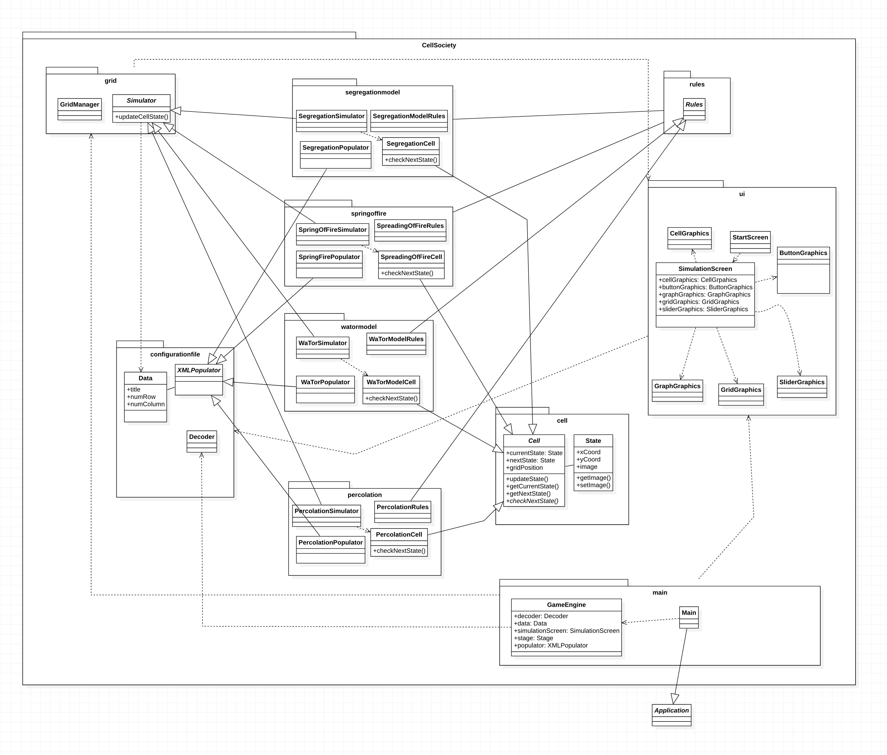
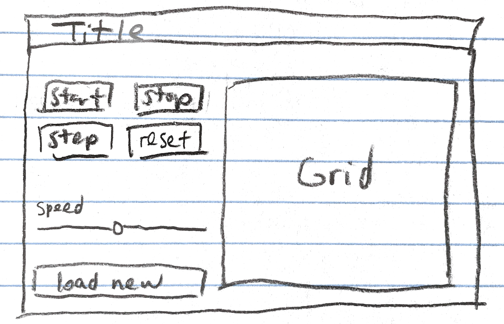

# Cell Society Design Plan

### Team Number: team01

### Names

Ji Yun Hyo - jh160<br>
Shaw Phillips - sp422 <br>
Harrison Huang - hlh38

## Overview


The overall design implements a MVC pattern. Model component represents a package that holds the
data about a simulation. Model also has the capability to update the Controller as data changes.
View handles the UI and provides visualization for the simulation. Controller acts on Model and View
to pass data around, separating Model from View. Each package can be partitioned into one of three
parts as follows. <br><br> Packages for each component <br>   Model: segregationmodel, springoffire,
watormodel, percolation, cells, rules<br>  View:
view <br> Controller: configurationfile, grid, main

## User Interface


Opening the application should reveal a start-up/splash screen giving users the option to load a new
XML file to start a simulation.

For the model view, the user will have several buttons available to change the way the simulation
works. The grid itself is placed on the right side, while the left side has buttons for start, stop,
step, and reset, as well as a slider for changing the speed and a button for loading a new XML file.
In the case of percolation, the user should be able to click directly on the grid to interact with
specific cells to open them. If an error were to occur (such as bad data input, etc.), such an error
message could be printed on top of the grid.

For further development of the UI, more sliders can be added for specific simulations to change
settings for how the simulation functions. There can also be an info button that pops up a window
with a description of the background behind the current simulation.

## Configuration File Format

Example Fire XML File

```xml
<?xml version="1.0" encoding="UTF-8"?>
<Simulation simulation="FireExample">
  <title>Fire Example</title>
  <desciption>Example simulation of spreading fire</desciption>
  <author>Shaw</author>
  <rows>50</rows>
  <cols>50</cols>
  <probCatch>.25</probCatch>
</Simulation>
```

Exmaple WaTor XML File

```xml
<?xml version="1.0" encoding="UTF-8"?>
<Simulation simulation="WaTor Example">
  <title>WaTor Example</title>
  <description>Example WaTor Simulation</description>
  <rows>30</rows>
  <cols>30</cols>
  <fishRate>1</fishRate>
  <sharkRate>20</sharkRate>
  <sharkStarve>15</sharkStarve>
</Simulation>
```

## Design Details

Main role of the Controller component is to act as the bridge between Model and View components so
that the two components are completely independent of each other. When the simulation is launched,
Main.java calls SimulationEngine.java which initializes the splash screen (View component) with the
option to load a simulation-specific XML file. Once the file is chosen, SimulationEngine uses
Decoder.java inside the ‘configurationfile’ package to determine the specific simulation/model to
load, and initializes all constructors of the chosen model using the data read in from the XML
files. Controller also uses the View component to display SimulationScreen.

Main role of the Model component is to store data and rules for the simulation and to update states
of each cell. Four main parts of the Model component are defined by extending the following
super-classes: Simulator, Populator, Rules, and Cell. Populator is the abstract class that defines
the logic for interpreting and populating the cells according to the specific simulation that is
chosen. Simulator is an abstract super-class that uses GridManager.java to create a grid of cells.
Simulator object uses the GridManager.java to create a grid of cells. Simulator also keeps track of
the states of all the cells in the grid. Cell is an abstract class that defines the different states
a cell could be in as well as the grid position of the Cell object in the grid stored inside
GridManager.java. Cell has the abstract method updateState which uses Rules and the ArrayList of its
neighbors to determine the nextState for the Cell. Each state is represented by a State object. Once
all Cells are updated, Simulator takes the information and uses GridManager to update the entire
grid, which is represented using a 2-D integer array, with each int value stored at a specific
coordinate representing the state of the Cell (e.g. 1 - Fire, 2 - Tree, 3 - Empty). GridManager or
the Simulator can now use the ‘view’ package (part of View component)  to display the updated grid.

Main role of the View component is to take in the updated grid from the Controller component and to
display the updated grid. Once the updated grid is displayed, the ‘view’ package informs the
sub-class of Simulator, which again updates all the cells and returns the resulting grid to the View
component.

The primary goal of the design is to have each component/sub-component essentially act as an
individual unit. For example, each Cell object calculates its own currenState/nextState using the
Rules without having to “know” what other Cell objects in the same model are doing. Simulator also
does not have to know how each Cell was updated. View component also does not need to know the logic
of a specific model. Similarly, the Controller component reads/interprets the XML file without
knowing how the model is going to use these values or how the View component would display the
resulting grids.

## Design Considerations

We thought about using 2-D int array instead of List of Lists. We decided to use List of Lists
instead. An int array would be convenient to represent a situation where the grid is square (e.g.
has four adjacent sides). However, we could imagine a situation where there are more than 4
neighboring sides. If so, the int array implementation may not be the best representation. So
instead, we are going to create an adjacency list to represent the grid and all the neighbors of
each Cell.

We considered building a universal model that was capable of simulating all five simulations based
on specific configurations passed with an XML file. This would have the benefit of reducing the
number of classes we would need in total, but we ultimately decided that doing so would
unnecessarily complicate the Model portion of the program, because we would have to program the
ability to handle different simulations based on different configurations. We decided that instead
creating separate classes for each simulation would be much more organized and would also allow us
to program in a much more simplistic and readable manner.

Instead of a 2-D int array, we considered a 2-D array of Cell objects to implement the grid. The
latter would be more flexible if later down in the road we want to display more information about
each Cell. For now, we’ve decided to use int arrays to store the states of each Cell. This way, when
the View component receives the int array, it will not have to call Cell methods to retrieve the
data.

## Team Responsibilities

* Team Member #1 Shaw - Controller (configurationfile)
  The controller portion entails the reading and passing of values based on configuration files.
  This should involve parsing the configuration files and allowing the model and view portions to
  take values from the controller in order to control the various simulations.


* Team Member #2 Harrison - View: designing UI to display the grid, interpreting data from the
  simulator and drawing representative grids, configuring user controls, allowing for user input in
  the grid and in other functions


* Team Member #3 Jiyun - Model: implementing the logic for each simulation, processing and storing
  data/rule for each model iyun - Model